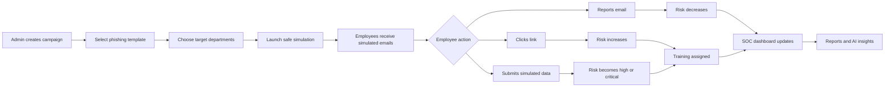
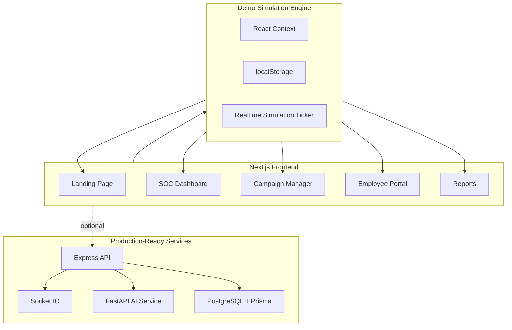

<div align="center">

# PhishNet AI

## Human Firewall Intelligence Platform

An enterprise-grade AI-powered phishing simulation, cyber-awareness training, and human risk intelligence platform built with a futuristic SOC command center experience.

[](https://nextjs.org/)
[](https://react.dev/)
[](https://www.typescriptlang.org/)
[](https://tailwindcss.com/)
[](https://fastapi.tiangolo.com/)
[](https://www.postgresql.org/)

**Simulate phishing safely. Measure human risk intelligently. Train employees automatically.**

</div>

---

## Executive Summary

PhishNet AI is a premium cybersecurity awareness platform that helps organizations understand and improve their weakest attack surface: human behavior.

Security teams can launch safe phishing simulations, monitor how employees respond, calculate human cyber risk scores, identify vulnerable departments, trigger adaptive training, and generate executive-ready reports from a realtime SOC-style dashboard.

The product is built as a polished hackathon-ready enterprise application with:

- A futuristic SOC command center
- Realistic but safe phishing simulations
- AI-assisted template generation
- Employee and department risk intelligence
- Adaptive awareness training
- Gamified employee portal
- Reports and CSV exports
- Realtime demo analytics
- Production-ready backend, AI service, Prisma schema, and Docker setup

---

## The One-Line Pitch

**PhishNet AI turns phishing simulations into realtime human cyber-risk intelligence, then automatically trains employees before attackers can exploit them.**

---

## Why This Matters

Most cyberattacks do not begin with advanced malware. They begin with a person clicking the wrong link, trusting a fake login page, scanning a malicious QR code, or approving an unexpected MFA prompt.

PhishNet AI helps organizations answer critical questions:

- Which employees are most vulnerable?
- Which departments create the highest cyber risk?
- Which phishing themes are most effective against the organization?
- Who reports suspicious emails quickly?
- Who needs immediate awareness training?
- Is the human firewall getting stronger over time?

---

## What It Does

| Capability | What It Means |
| --- | --- |
| Phishing Campaigns | Create, schedule, and launch safe simulation campaigns |
| AI Email Templates | Generate realistic training emails for different scenarios |
| Fake Login Simulation | Show safe fake portals without storing real secrets |
| Human Risk Scores | Score employees based on clicks, reports, submissions, and training |
| Department Intelligence | Identify risky teams and compare security posture |
| SOC Dashboard | Monitor live campaigns, alerts, radar, maps, and metrics |
| Adaptive Training | Assign courses automatically after unsafe behavior |
| AI Cyber Assistant | Ask natural-language security questions about current data |
| Advanced Lab | Demonstrate MFA fatigue, QR phishing, deepfake voice, and attachment attacks |
| Reports | Export campaign, employee, department, and event data |

---

## How The Platform Works



---

## Core User Journey

1. A security admin logs in and passes MFA.
2. The admin creates a phishing campaign.
3. The admin selects a realistic template, such as Microsoft 365, HR payroll, invoice fraud, CEO impersonation, QR phishing, or fake Zoom.
4. The admin targets one or more departments.
5. The campaign launches in safe demo mode.
6. Employees see simulated phishing emails in the employee portal.
7. Employees can report the email, click the payload, or submit demo input in a fake portal.
8. The platform updates live metrics, logs, risk scores, and department posture.
9. Risky employees are assigned training automatically.
10. Employees complete quizzes, earn badges, and reduce their risk.
11. Executives receive reports showing human firewall improvement.

---

## Product Screens And Routes

| Route | Purpose |
| --- | --- |
| `/` | Premium landing page with animated cyber visuals |
| `/login` | Role-based login gateway |
| `/signup` | Organization onboarding simulation |
| `/forgot-password` | Secure password recovery simulation |
| `/mfa` | MFA verification flow |
| `/dashboard/soc` | Realtime SOC command center |
| `/dashboard/campaigns` | Campaign creation and launch |
| `/dashboard/templates` | Template library and AI synthesizer |
| `/dashboard/risk` | Human risk intelligence |
| `/dashboard/analytics` | Executive analytics center |
| `/dashboard/training` | Awareness training overview |
| `/dashboard/ai-coach` | AI cyber assistant |
| `/dashboard/lab` | Advanced phishing simulation lab |
| `/dashboard/reports` | Reports and CSV exports |
| `/dashboard/profile` | Operator profile and RBAC view |
| `/dashboard/settings` | Enterprise security controls |
| `/portal` | Employee awareness portal |
| `/portal/login-simulation` | Safe phishing landing pages |

---

## Main Modules Explained

### 1. SOC Command Center

The SOC dashboard is the heart of the platform. It gives analysts a realtime view of the organization's human attack surface.

It includes:

- Cyber resilience score
- Click-through rate
- Credential-submission simulation count
- Reporting rate
- Live event feed
- Animated threat map
- Cyber radar scanner
- Department posture charts
- Historical campaign comparison

### 2. Campaign Engine

Admins can build campaigns by choosing a template and target departments. When launched, the system creates simulated delivery events and starts tracking employee behavior.

Campaign metrics include:

- Sent
- Opened
- Clicked
- Submitted
- Reported

### 3. Template Manager

The template manager contains realistic awareness-training templates:

- Microsoft 365 password expiry
- HR payroll verification
- Bank verification
- Invoice fraud
- QR phishing
- CEO impersonation
- Fake Zoom invite
- Internship scam

The AI-style generator can synthesize safe training emails based on audience, scenario, and urgency.

### 4. Human Risk Intelligence

Every employee receives a dynamic cyber risk score. The score changes based on behavior:

| Behavior | Risk Impact |
| --- | --- |
| Reports suspicious email | Risk decreases |
| Completes training | Risk decreases |
| Clicks simulation link | Risk increases |
| Submits demo data | Risk increases sharply |
| Repeated failures | Risk increases over time |

Risk categories:

- Safe
- Medium Risk
- High Risk
- Critical

### 5. Employee Portal

Employees use the portal to interact with simulations and training.

They can:

- Read simulated phishing emails
- Report suspicious messages
- Click safe simulation links
- See immediate education screens
- Complete quizzes
- Earn badges
- View leaderboard position

### 6. Adaptive Training

Training is assigned automatically when an employee fails a simulation. Courses include lessons, quizzes, pass/fail logic, badge rewards, and risk-score reduction.

Example modules:

- Introduction to Phishing and Social Engineering
- Credential Harvesting Protection
- Advanced Scams: QR Codes and MFA Fatigue

### 7. AI Cyber Assistant

The AI assistant reads the current simulation state and answers security questions such as:

```text
Show risky departments
Predict vulnerable users
Generate phishing report
Explain phishing indicators
Analyze security posture
```

### 8. Advanced Phishing Lab

The lab safely demonstrates modern attacks:

- MFA fatigue attacks
- QR phishing attacks
- Deepfake voice phishing
- Malicious attachment analysis

This makes the platform not only a dashboard, but also an interactive cyber-awareness learning environment.

### 9. Reports Center

The reports center turns simulation data into leadership-ready intelligence.

Exports include:

- Campaign analytics CSV
- Employee risk CSV
- Threat event logs CSV
- Department risk CSV
- Print-ready executive report

---

## Safe Simulation Design

PhishNet AI is intentionally built with safety guardrails.

Fake portals show realistic training screens, but they do not store real submitted values.

The system records only the event:

```text
Employee clicked link
Employee submitted simulated credentials
Employee reported phishing email
```

This makes it useful for ethical internal training while avoiding dangerous credential collection.

---

## Architecture



---

## Tech Stack

### Frontend

- Next.js 15
- React 19
- TypeScript
- Tailwind CSS
- Framer Motion
- Recharts
- Lucide Icons

### Backend

- Node.js
- Express.js
- Socket.IO
- JWT
- RBAC
- Helmet
- Rate limiting

### AI Service

- Python
- FastAPI
- OpenAI API support
- Deterministic fallback mode

### Database

- PostgreSQL
- Prisma ORM schema

### Deployment

- Docker
- Docker Compose
- Vercel-ready frontend
- Railway/Supabase-ready backend and database

---

## Quick Start

Install dependencies:

```bash
npm install
```

Start the app:

```bash
npm run dev
```

Open:

```text
http://localhost:3001
```

---

## Demo Login Details

Any 6-digit MFA code works in demo mode.

Example:

```text
123456
```

| Role | Email |
| --- | --- |
| Super Admin | `admin@enterprise.com` |
| SOC Analyst | `analyst@enterprise.com` |
| Department Manager | `manager@enterprise.com` |
| High-risk Employee | `dvance@enterprise.com` |
| Low-risk Employee | `tstark@enterprise.com` |

---

## Best Demo Script

Use this flow for a hackathon or project presentation:

1. Open the landing page and show the premium cybersecurity UI.
2. Login as `admin@enterprise.com`.
3. Enter any 6-digit MFA code.
4. Show the SOC command center.
5. Create a campaign in Campaigns.
6. Select all departments and launch it.
7. Return to the SOC dashboard and show live telemetry.
8. Open Analytics Center and explain the human firewall index.
9. Ask AI Assistant: `Show risky departments`.
10. Login as employee `dvance@enterprise.com`.
11. Open the simulated mailbox.
12. Click the phishing payload.
13. Show the training warning banner on the fake login page.
14. Submit demo input.
15. Show the education screen explaining red flags.
16. Complete employee training.
17. Export reports from the Reports Center.

---

## Optional Full-Service Mode

The frontend works completely in demo mode. For a full deployable architecture, use Docker Compose.

Create environment file:

```bash
cp .env.example .env
```

Start services:

```bash
docker compose up --build
```

| Service | URL |
| --- | --- |
| Web App | `http://localhost:3001` |
| Express API | `http://localhost:4000/health` |
| FastAPI AI Service | `http://localhost:8000/health` |
| PostgreSQL | `localhost:5432` |

---

## Backend API

Express API location:

```text
server/src/index.ts
```

Main endpoints:

| Endpoint | Purpose |
| --- | --- |
| `GET /health` | API health check |
| `POST /auth/login` | Demo JWT login |
| `GET /campaigns` | List campaigns |
| `POST /campaigns` | Create campaign |
| `POST /campaigns/:id/launch` | Launch simulation |
| `POST /events` | Record safe simulation event |
| `GET /analytics/overview` | Get aggregate metrics |

Security features:

- JWT authentication
- RBAC middleware
- Rate limiting
- Helmet headers
- CORS policy
- Sanitized event storage
- No secret capture

---

## AI Service

FastAPI service location:

```text
ai-service/main.py
```

Endpoints:

| Endpoint | Purpose |
| --- | --- |
| `GET /health` | AI service health check |
| `POST /risk-score` | Calculate risk score |
| `POST /generate-template` | Generate safe training template |

If `OPENAI_API_KEY` is present, the service can use OpenAI. If not, it still works with a deterministic fallback.

---

## Database Schema

Prisma schema:

```text
prisma/schema.prisma
```

Models include:

- Organization
- User
- Department
- Campaign
- CampaignDepartment
- PhishingTemplate
- EmailLog
- ClickEvent
- CredentialAttempt
- RiskScore
- AnalyticsSnapshot
- TrainingModule
- UserTraining
- Notification
- AuditLog

Important: `CredentialAttempt` stores only that a simulated submission happened. It does not store the submitted secret.

---

## Project Structure

```text
phishnet-app/
  src/
    app/
      dashboard/
      portal/
      login/
      signup/
      mfa/
      forgot-password/
    components/
    context/
  server/
    src/index.ts
  ai-service/
    main.py
  prisma/
    schema.prisma
  docker-compose.yml
  Dockerfile
  README.md
```

---

## Validation

Run checks:

```bash
npm run lint
npm run build
python -m py_compile ai-service\main.py
```

Verified during development:

- Frontend lint passes
- Production Next.js build passes
- FastAPI Python file compiles
- Browser smoke test passed for login, MFA, SOC, analytics, campaigns, AI assistant, employee portal, and safe simulation page

---

## Production Readiness Notes

Before real enterprise deployment:

- Replace demo auth with real identity provider integration
- Enforce real password hashing and MFA verification
- Connect Prisma to production PostgreSQL
- Add tenant isolation tests
- Use approved internal domains only
- Add immutable audit logging
- Add SIEM/SOAR integrations
- Add email delivery provider only for authorized internal campaigns
- Add monitoring, backups, and incident-response playbooks

---

## Final Summary

PhishNet AI is not just a phishing simulator. It is a complete human cyber-risk intelligence platform.

It shows how an organization can move from simple security awareness training to a measurable, realtime, adaptive human firewall program.

It helps security teams:

- Find vulnerable users
- Detect risky departments
- Improve reporting behavior
- Assign training automatically
- Explain phishing indicators clearly
- Track cyber posture over time
- Present executive-ready human risk reports

**The result: a smarter organization, stronger employees, and a measurable human firewall.**

