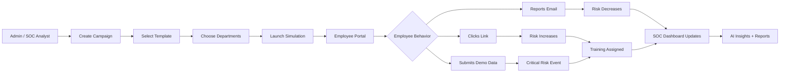
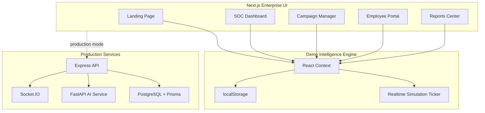
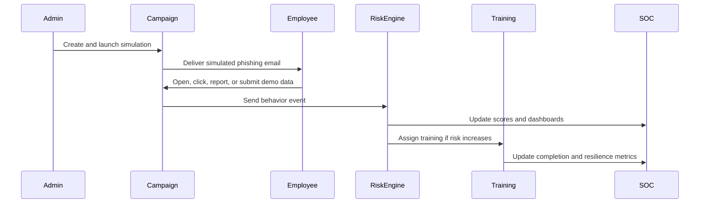

<div align="center">

# PHISHNET AI

### Human Firewall Intelligence Platform

<p>
  A futuristic enterprise cybersecurity platform for safe phishing simulations, realtime human-risk intelligence, adaptive awareness training, and SOC-grade executive reporting.
</p>

<p>
  
  
  
  
  
  
</p>

<p>
  <b>Simulate attacks safely.</b>
  <span> | </span>
  <b>Measure human risk.</b>
  <span> | </span>
  <b>Train employees automatically.</b>
  <span> | </span>
  <b>Report cyber posture instantly.</b>
</p>

</div>

---

## Product Identity

PhishNet AI is designed like a billion-dollar cybersecurity startup product: a premium dark SOC interface, animated cyber visuals, realtime risk telemetry, human-behavior analytics, an AI cyber assistant, and a safe employee training portal.

It is not just a phishing simulator. It is a **Human Firewall Intelligence Platform**.

> The platform helps security teams discover who is vulnerable, why they are vulnerable, which departments need support, and what training should happen next.

---

## Command Center Snapshot

<table>
  <tr>
    <td><b>Primary User</b></td>
    <td>Security teams, SOC analysts, managers, and employees</td>
  </tr>
  <tr>
    <td><b>Main Goal</b></td>
    <td>Convert phishing simulations into measurable human cyber-risk intelligence</td>
  </tr>
  <tr>
    <td><b>Core Experience</b></td>
    <td>Launch campaign -> observe behavior -> score risk -> assign training -> export reports</td>
  </tr>
  <tr>
    <td><b>Demo Storage</b></td>
    <td>React Context + localStorage</td>
  </tr>
  <tr>
    <td><b>Production Architecture</b></td>
    <td>Next.js frontend, Express API, FastAPI AI service, PostgreSQL, Prisma, Docker</td>
  </tr>
  <tr>
    <td><b>Safety Model</b></td>
    <td>No real email delivery, no real credential capture, safe simulation events only</td>
  </tr>
</table>

---

## Table Of Contents

- [Why PhishNet AI Exists](#why-phishnet-ai-exists)
- [How It Works](#how-it-works)
- [Platform Elements](#platform-elements)
- [Application Modules](#application-modules)
- [Project Structure](#project-structure)
- [Architecture](#architecture)
- [Safe Simulation Design](#safe-simulation-design)
- [Quick Start](#quick-start)
- [Demo Credentials](#demo-credentials)
- [Presentation Script](#presentation-script)
- [Backend And AI Services](#backend-and-ai-services)
- [Database Design](#database-design)
- [Validation](#validation)

---

## Why PhishNet AI Exists

Modern cyberattacks often begin with human trust:

- An employee clicks a fake Microsoft 365 link.
- Finance receives a fraudulent invoice update.
- HR reacts to a payroll urgency email.
- A user scans a QR phishing code.
- Someone approves an unexpected MFA prompt.

Traditional training tells employees what phishing is. PhishNet AI goes further:

- It simulates realistic attacks safely.
- It measures employee behavior.
- It scores human risk.
- It identifies risky departments.
- It assigns adaptive training.
- It proves improvement with analytics.

---

## How It Works



### The Simple Explanation

1. The admin launches a safe phishing campaign.
2. Employees receive simulated phishing emails inside the portal.
3. The system tracks opens, clicks, reports, and simulated submissions.
4. Every action updates employee and department risk.
5. Risky users automatically receive training.
6. SOC dashboards and reports update in realtime.

---

## Platform Elements

<table>
  <tr>
    <th>Element</th>
    <th>Description</th>
    <th>Impact</th>
  </tr>
  <tr>
    <td><b>SOC Dashboard</b></td>
    <td>Realtime cyber command center with radar, maps, charts, and live logs</td>
    <td>Gives analysts instant visibility</td>
  </tr>
  <tr>
    <td><b>Campaign Engine</b></td>
    <td>Create and launch department-targeted phishing simulations</td>
    <td>Tests human defenses safely</td>
  </tr>
  <tr>
    <td><b>AI Template Lab</b></td>
    <td>Generate safe phishing-awareness templates by scenario</td>
    <td>Speeds up training campaign creation</td>
  </tr>
  <tr>
    <td><b>Risk Intelligence</b></td>
    <td>Scores users and departments from behavior patterns</td>
    <td>Finds vulnerable people and teams</td>
  </tr>
  <tr>
    <td><b>Employee Portal</b></td>
    <td>Mailbox, learning modules, quizzes, badges, and leaderboard</td>
    <td>Turns failure into learning</td>
  </tr>
  <tr>
    <td><b>AI Cyber Assistant</b></td>
    <td>Answers security questions using live simulation data</td>
    <td>Creates analyst-ready insights</td>
  </tr>
  <tr>
    <td><b>Advanced Lab</b></td>
    <td>MFA fatigue, QR phishing, deepfake voice, attachment sandbox demos</td>
    <td>Explains modern attack patterns</td>
  </tr>
  <tr>
    <td><b>Reports Center</b></td>
    <td>CSV exports and print-ready executive report views</td>
    <td>Helps leadership track cyber posture</td>
  </tr>
</table>

---

## Application Modules

### 1. Landing Page

Route: `/`

A premium cyber product landing page with animated background particles, cyber grid visuals, threat-map preview, feature sections, and clear calls to action.

### 2. Authentication

Routes: `/login`, `/signup`, `/forgot-password`, `/mfa`

Includes role-based demo login, signup simulation, password recovery simulation, MFA flow, and session persistence.

Roles:

- Super Admin
- Security Analyst
- Department Manager
- Employee

### 3. SOC Command Center

Route: `/dashboard/soc`

The main realtime dashboard:

- Cyber resilience ratio
- Click-through rate
- Credential-submission simulation count
- Reporting rate
- Animated live threat map
- Cyber radar scanner
- Department posture chart
- Historical campaign analytics
- Live event ticker

### 4. Campaign Manager

Route: `/dashboard/campaigns`

Create and launch campaigns by selecting:

- Campaign name
- Phishing template
- Target departments

Campaign metrics update as simulated behavior occurs.

### 5. Template Manager

Route: `/dashboard/templates`

Includes safe phishing-awareness templates:

- Microsoft 365 account warning
- HR payroll verification
- Bank verification
- Invoice fraud
- QR phishing
- CEO impersonation
- Fake Zoom invite
- Internship scam

### 6. Human Risk Intelligence

Route: `/dashboard/risk`

Shows employee and department risk:

- Risk score
- Failed simulations
- Passed simulations
- Completed training
- Badges
- Department filters
- Search and sorting
- Risk charts

### 7. Analytics Center

Route: `/dashboard/analytics`

Executive analytics view:

- Human firewall index
- Average risk score
- Click-through rate
- Self-report rate
- Campaign performance fabric
- Risk classification mix
- Department behavior heatmap

### 8. AI Cyber Assistant

Route: `/dashboard/ai-coach`

Ask questions like:

```text
Show risky departments
Predict vulnerable users
Generate phishing report
Explain phishing indicators
Analyze security posture
```

### 9. Simulation Lab

Route: `/dashboard/lab`

Interactive demonstrations:

- MFA fatigue attack
- QR phishing
- Deepfake voice phishing
- Malicious attachment sandbox analysis

### 10. Reports Center

Route: `/dashboard/reports`

Export:

- Campaign analytics
- Employee risk profiles
- Threat event logs
- Department risk reports

### 11. Employee Portal

Route: `/portal`

Employees can:

- View simulated phishing emails
- Report suspicious emails
- Click safe payloads
- See educational failure screens
- Complete training
- Earn badges
- View leaderboard

---

## Project Structure

```text
phishnet-app/
  README.md                         # Project documentation and demo guide
  package.json                      # Frontend scripts and dependencies
  next.config.ts                    # Next.js config and security headers
  docker-compose.yml                # Full stack Docker orchestration
  Dockerfile                        # Frontend production image
  .env.example                      # Environment variable template
  .dockerignore                     # Docker build exclusions

  src/
    app/
      page.tsx                      # Landing page
      layout.tsx                    # Root layout and app provider
      globals.css                   # Global cyber design system

      login/page.tsx                # Login screen
      signup/page.tsx               # Signup screen
      forgot-password/page.tsx      # Password recovery simulation
      mfa/page.tsx                  # MFA verification screen

      portal/
        page.tsx                    # Employee portal
        login-simulation/page.tsx   # Safe fake login simulations

      dashboard/
        layout.tsx                  # Dashboard shell and navigation
        page.tsx                    # Dashboard redirect
        soc/page.tsx                # SOC command center
        campaigns/page.tsx          # Campaign management
        templates/page.tsx          # Template manager and AI lab
        risk/page.tsx               # Human risk intelligence
        analytics/page.tsx          # Analytics center
        training/page.tsx           # Training overview
        ai-coach/page.tsx           # AI cyber assistant
        lab/page.tsx                # Advanced simulation lab
        reports/page.tsx            # Reports center
        profile/page.tsx            # Operator profile
        settings/page.tsx           # Enterprise settings

    components/
      ChartMount.tsx                # Safe chart mounting wrapper
      CyberParticles.tsx            # Animated background particles
      DashboardCard.tsx             # Premium glass dashboard card
      LiveThreatMap.tsx             # Animated attack-map visualization
      RadarScan.tsx                 # SOC-style radar scanner

    context/
      SimContext.tsx                # Main demo simulation engine

  server/
    package.json                    # Express API dependencies
    Dockerfile                      # API container image
    tsconfig.json                   # API TypeScript config
    src/index.ts                    # JWT/RBAC/Socket.IO API server

  ai-service/
    requirements.txt                # Python dependencies
    Dockerfile                      # AI service container image
    main.py                         # FastAPI AI risk and template service

  prisma/
    schema.prisma                   # PostgreSQL production schema

  public/
    *.svg                           # Static assets
```

### Structure In One Sentence

`src/` is the frontend product, `SimContext.tsx` is the demo brain, `server/` is the production API layer, `ai-service/` is the AI layer, and `prisma/` defines the production database.

---

## Architecture



---

## Data Flow



---

## Safe Simulation Design

This project is intentionally safe.

<table>
  <tr>
    <th>Risky Real-World Behavior</th>
    <th>PhishNet AI Safe Behavior</th>
  </tr>
  <tr>
    <td>Sending real phishing emails</td>
    <td>Simulates delivery inside the app</td>
  </tr>
  <tr>
    <td>Collecting real passwords</td>
    <td>Records only a simulated submission event</td>
  </tr>
  <tr>
    <td>Capturing MFA tokens</td>
    <td>Shows training UI only</td>
  </tr>
  <tr>
    <td>Gathering bank or identity data</td>
    <td>Never stores submitted secret values</td>
  </tr>
  <tr>
    <td>Running unauthorized campaigns</td>
    <td>Designed for approved internal training only</td>
  </tr>
</table>

---

## Tech Stack

| Layer | Technology |
| --- | --- |
| Frontend | Next.js 15, React 19, TypeScript |
| Styling | Tailwind CSS, custom cyber design system |
| Animation | Framer Motion, canvas particles |
| Charts | Recharts |
| Icons | Lucide React |
| Demo State | React Context, localStorage |
| API | Express.js, JWT, RBAC, Helmet, rate limiting |
| Realtime | Socket.IO |
| AI | FastAPI, OpenAI-ready endpoint, fallback mode |
| Database | PostgreSQL, Prisma |
| Deployment | Docker, Docker Compose |

---

## Quick Start

```bash
npm install
npm run dev
```

Open:

```text
http://localhost:3001
```

---

## Demo Credentials

MFA accepts any 6-digit code in demo mode.

Use:

```text
123456
```

| Role | Email |
| --- | --- |
| Super Admin | `admin@enterprise.com` |
| SOC Analyst | `analyst@enterprise.com` |
| Department Manager | `manager@enterprise.com` |
| High-risk Employee | `dvance@enterprise.com` |
| Low-risk Employee | `tstark@enterprise.com` |

---

## Presentation Script

Use this for a fast, impressive demo:

1. Open the landing page and explain the Human Firewall Intelligence concept.
2. Login as `admin@enterprise.com`.
3. Enter MFA code `123456`.
4. Show the SOC command center.
5. Create a campaign in Campaigns.
6. Select all departments and launch it.
7. Return to SOC and show live telemetry.
8. Open Analytics and explain the human firewall index.
9. Ask AI Assistant: `Show risky departments`.
10. Login as employee `dvance@enterprise.com`.
11. Open the simulated mailbox.
12. Click the safe phishing payload.
13. Show the training banner on the fake portal.
14. Submit demo input.
15. Show the red-flag education screen.
16. Complete training and show badge/risk improvement.
17. Export report from Reports Center.

---

## Backend And AI Services

<details>
<summary><b>Express API</b></summary>

Location:

```text
server/src/index.ts
```

Endpoints:

| Endpoint | Purpose |
| --- | --- |
| `GET /health` | API health check |
| `POST /auth/login` | Demo JWT login |
| `GET /campaigns` | List campaigns |
| `POST /campaigns` | Create campaign |
| `POST /campaigns/:id/launch` | Launch campaign |
| `POST /events` | Record simulation event |
| `GET /analytics/overview` | Return aggregate metrics |

Security controls:

- JWT authentication
- RBAC middleware
- Rate limiting
- Helmet security headers
- CORS policy
- Safe event-only logging

</details>

<details>
<summary><b>FastAPI AI Service</b></summary>

Location:

```text
ai-service/main.py
```

Endpoints:

| Endpoint | Purpose |
| --- | --- |
| `GET /health` | AI service health check |
| `POST /risk-score` | Calculate human risk score |
| `POST /generate-template` | Generate safe training template |

The service supports OpenAI when `OPENAI_API_KEY` is configured. Without a key, it still works using deterministic fallback logic.

</details>

---

## Database Design

Prisma schema:

```text
prisma/schema.prisma
```

Important models:

| Model | Purpose |
| --- | --- |
| `Organization` | Tenant/company boundary |
| `User` | Employees, admins, analysts, managers |
| `Department` | Business unit risk grouping |
| `Campaign` | Simulation campaign |
| `PhishingTemplate` | Training email template |
| `EmailLog` | Delivery/open/report style events |
| `ClickEvent` | Link-click event |
| `CredentialAttempt` | Simulated submission marker only |
| `RiskScore` | Historical risk scoring |
| `TrainingModule` | Awareness training content |
| `UserTraining` | Employee training assignments |
| `Notification` | User notification records |
| `AuditLog` | Security audit trail |

Generate Prisma client:

```bash
npm run prisma:generate
```

---

## Docker Deployment

Create an environment file:

```bash
cp .env.example .env
```

Start the full stack:

```bash
docker compose up --build
```

| Service | URL |
| --- | --- |
| Web App | `http://localhost:3001` |
| Express API | `http://localhost:4000/health` |
| FastAPI AI Service | `http://localhost:8000/health` |
| PostgreSQL | `localhost:5432` |

---

## Validation

Run:

```bash
npm run lint
npm run build
python -m py_compile ai-service\main.py
```

Verified:

- Frontend lint passes
- Production Next.js build passes
- FastAPI file compiles
- Browser smoke test passed for login, MFA, SOC, analytics, campaigns, AI assistant, employee portal, and safe simulation portal

---

## Production Readiness Checklist

- Replace demo auth with real identity provider integration.
- Enforce production password hashing and MFA.
- Connect Prisma to managed PostgreSQL.
- Add tenant isolation tests.
- Restrict campaigns to approved company-owned domains.
- Add immutable audit logging.
- Add SIEM/SOAR integrations.
- Add email delivery provider only for authorized internal campaigns.
- Add monitoring, alerting, backups, and incident-response playbooks.

---

## Final Impact

PhishNet AI transforms awareness training into measurable cyber intelligence.

It helps organizations:

- Discover vulnerable users
- Detect risky departments
- Train employees at the right time
- Improve reporting behavior
- Explain phishing indicators clearly
- Track human cyber posture over time
- Present executive-ready security reports

<div align="center">

### PhishNet AI makes the human firewall visible, measurable, and stronger.

</div>

